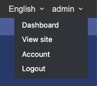
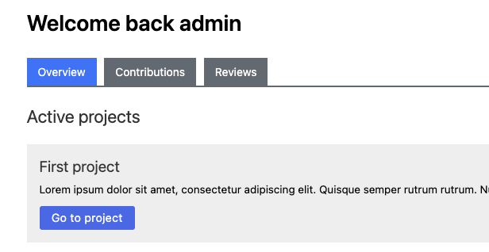
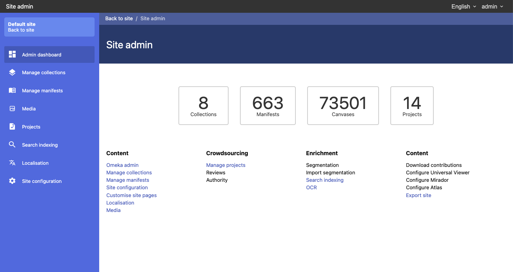
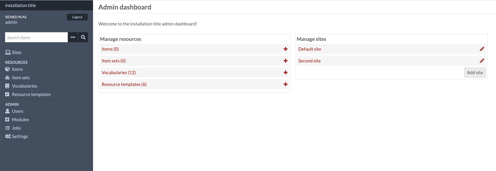

# Administration pages

Here are a list of the various administration pages for the site, the site admin and the global admin. These are referenced throughout this documentation.

## User dashboard

The most important page in your installation is the user homepage. Each site in Omeka has a user homepage. If you navigate to your site you should see your user name in the top right corner. You can get to the dashboard from this menu.

From this page you can see active projects, your own contributions and reviews that are assigned to you.

## Madoc admin page

If you are an administrator you will see a "Site admin" link in the top left of the top bar. If you click on that it will take you to the admin homepage. From here you will be able to manage content, create new projects and manage various aspects of the site.


Madoc is still in development, some of the administration links are not yet available!


## Omeka admin page

From the Admin dashboard you can click on "Omeka admin" to get to the underlying Omeka interface.

At the moment the Omeka backend is only used to manage users and to create new sites.

