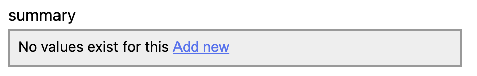

# Metadata management

IIIF Metadata and descriptive properties are stored in Madoc individually by the property they are assigned, language they are in and the position they appear if there are more than one.

When a piece of IIIF is imported into a site 2 copies of the metadata is stored:

* **Canonical metadata** - does not change, used when subsequently imported into a different site
* **Site metadata** - can be changed, used when displaying on a specific site

This allows the same resource to be imported into multiple sites with the original metadata, even if the metadata is changed on a particular site. The data model contains columns for future work to support more complex syncing for these use-cases.

These rows are transformed into IIIF-compliant language fields when requesting specific IIIF resources. For managing and editing the fields, this expanded format is used to avoid ambiguity.

### Data model



```javascript
{
  "id": 1,
  "key": "label",
  "value": "Scottish Bridges",
  "language": "none",
  "source": "iiif",
  "resource_id": 1,
  "site_id": null,
  "readonly": false,
  "edited": false,
  "auto_update": true,
  "data": null
}
```



```javascript
{
  "id": 4,
  "key": "metadata.0.label",
  "value": "Title",
  "language": "none",
  "source": "iiif",
  "resource_id": 2,
  "site_id": null,
  "readonly": false,
  "edited": false,
  "auto_update": true,
  "data": null
}
```



```javascript
{
  "id": 5,
  "key": "metadata.0.value",
  "value": "Forth Bridge illustrations 1886-1887",
  "language": "none",
  "source": "iiif",
  "resource_id": 2,
  "site_id": null,
  "readonly": false,
  "edited": false,
  "auto_update": true,
  "data": null
}
```



Here is a full example with a set of rows and the resulting IIIF JSON that is created from it.

| Key | Language | Value |
| :--- | :--- | :--- |
| `label` | en | EN label |
| `label` | fr | FR label |
| `requiredStatement.label` | en | Attribution |
| `requiredStatement.value` | en | Some attribution |
| `metadata.0.label` | en | Metadata label 1 |
| `metadata.0.value` | en | Metadata value 1 |
| `metadata.1.label` | en | Metadata value 2 |
| `metadata.1.value` | en | Metadata value 2 |

```javascript
{
  "label": {
    "en": ["EN label"],
    "fr": ["FR label"]
  },
  "requiredStatement": {
    "label": {"en": ["Attribution"]},
    "value": {"en": ["Some attribution"]}
  },
  "metadata": [
    {
      "label": { "en": ["Metadata label 1"] },
      "value": { "en": ["Metadata value 1"] }
    },
    {
      "label": { "en": ["Metadata label 2"] },
      "value": { "en": ["Metadata value 2"] }
    }
  ]
}
```

#### Full database schema

| **Column** | **Description** |
| :--- | :--- |
| **id** | Numeric ID for the individual Metadata value |
| **key** | Dot notation for property in the IIIF \(e.g. `metadata.0.label` \) |
| **value** | The value of the metadata item |
| **language** | Language code as described in the [IIIF Specification](https://iiif.io/api/presentation/3.0/#44-language-of-property-values) |
| **source** | Where this value was sourced from, usually always `iiif` . In future could be used to distinguish different sources of metadata. |
| **resource\_id** | The numeric ID for the IIIF resource this metadata will be attached to |
| **site\_id** | Metadata is per-site, so each site will copy the metadata when importing. If this metadata is changed, it will not be reflected on other sites. If this is `null` then the data is the canonical \(from import\). This allows for some reverting features in the future. |
| **readonly** | Currently unused, but when set will prevent manually updating this value. Intended to be used when metadata has been derived from another source. |
| **auto\_update** | When this is set, if the canonical \(site\_id = null\) is updated, then this will also be updated.  |
| **edited** | This indicates that the value has been updated in Madoc. Usually sets `auto_update` to false once updated. |
| **data** | Unstructured JSON field, could be used to store useful information about the field. Currently unused. |

### React-based editor

To present the user with a general purpose Metadata editor you can use the `<MetadataListEditor />`


There is a Github discussion open for improvements to the UI/UX of this editor [here](https://github.com/digirati-co-uk/madoc-platform/discussions/458)


```jsx
<MetadataListEditor 
  metadata={data} 
  template={['label', 'summary']} 
  onSave={({ diff, empty }) => {
    if (!empty) {
      doSomethingWithDiff(diff);
    }
  }} 
/>
```

* **metadata** - this is the list of values from any of the GET metadata endpoints. 
* **template** - for the properties listed, a prompt will be shown to add a value \(see below\)
* **onSave** - returns an object with 2 properties. `{diff: {}, empty: false}` the diff is the same format as the "Update metadata" request body and can be passed in. If empty is true, then no updates are required.



### Madoc JS API

All of the endpoints listed below are accessible in plugins or within Madoc through the [Madoc JS API](../getting-started.md#madoc-js-api).

```jsx
import { useApi } from '@madoc.io/types';

function MyComponent() {
  const api = useApi();
  
  // ...

  // Metadata keys + values
  await api.getMetadataKeys();
  await api.getMetadataValues();
  
  // Fetching metadata
  await api.getCanvasMetadata(canvasId);
  await api.getManifestMetadata(manifestId);
  await api.getCollectionMetadata(collectionId);
  await api.getProjectMetadata(projectId);
  
  // Updating metadata
  await api.updateCanvasMetadata(canvasId, diff);
  await api.updateManifestMetadata(manifestId, diff);
  await api.updateCollectionMetadata(collectionId, diff);
  await api.updateProjectMetadata(projectId, diff);
  
  // ...
}
```

The `GET` endpoints also have [React hooks](../getting-started.md#apihooks) available for quickly fetching 

```jsx
import { apiHooks } from '@madoc.io/types';

function MyComponent() {
  // Metadata keys + values
  apiHooks.getMetadataKeys(() => []);
  apiHooks.getMetadataValues(() => []);
    
  // Fetching metadata
  apiHooks.getCanvasMetadata(() => [canvasId]);
  apiHooks.getManifestMetadata(() => [manifestId]);
  apiHooks.getCollectionMetadata(() => [collectionId]);
  apiHooks.getProjectMetadata(() => [projectId]);
  
  // ...
}
```

There are also public APIs for fetching metadata for IIIF. These can be used on pages where the user is not required to be logged in.

```jsx
import { useApi, apiHooks } from '@madoc.io/types';

function MyComponent() {
  const api = useApi();
  
  // Using the API.
  await api.getSiteCanvasMetadata(canvasId);
  await api.getSiteManifestMetadata(manifestId);
  await api.getSiteCollectionMetadata(collectionId);
  
  // Using hooks.
  apiHooks.getSiteCanvasMetadata(() => [canvasId]);
  apiHooks.getSiteManifestMetadata(() => [manifestId]);
  apiHooks.getSiteCollectionMetadata(() => [collectionId]);
}
```



Metadata keys



For a given resource id \(IIIF\) it will return a list of unique labels in the metadata grouped by language along with how many instances of the label exists. This is used for configuring search, showing the most popular facets.






site.admin







List of unique labels and number of occurrences.


```javascript
{
  "metadata": [
    {
      "label": "Title",
      "total_items": 101,
      "language": "none"
    },
    {
      "label": "Full conditions of use",
      "total_items": 37,
      "language": "none"
    },
    {
      "label": "Collection",
      "total_items": 30,
      "language": "none"
    },
    {
      "label": "Provenance",
      "total_items": 30,
      "language": "none"
    },
    {
      "label": "Barcode",
      "total_items": 30,
      "language": "none"
    },
    {
      "label": "Edition",
      "total_items": 30,
      "language": "none"
    }
  ]
}
```







Metadata values



For a given resource id \(IIIF\) it will return a unique list of values from inside the metadata along side how many instances of the value exists. This is used for configuring search to fix certain facets into the search sidebar.






site.admin





Which metadata label should be filtered \(e.g. "Title"\)



Page of results







Returns all of the values for the given Metadata key/label. Ordered by frequency and paged.


```javascript
{
  "page": 1,
  "values": [
    {
      "total_items": 30,
      "language": "none",
      "value": "You have permission to make copies of this work under the <a target=\"_top\" href=\"http://creativecommons.org/licenses/by/4.0/\">Creative Commons Attribution 4.0 International Licence</a> unless otherwise stated."
    },
    {
      "total_items": 4,
      "language": "none",
      "value": "You have permission to make copies of this work under the <a target=\"_top\" href=\"http://creativecommons.org/licenses/by/4.0/\">Creative Commons Attribution 4.0 International Licence</a> unless otherwise stated."
    },
    {
      "total_items": 2,
      "language": "none",
      "value": "You have permission to make copies of this work under the <a target=\"_top\" href=\"http://creativecommons.org/licenses/by/4.0/\">Creative Commons Attribution 4.0 International Licence</a> unless otherwise stated."
    },
    {
      "total_items": 1,
      "language": "none",
      "value": "You have permission to make copies of this work under the <a target=\"_top\" href=\"http://creativecommons.org/licenses/by/4.0/\">Creative Commons Attribution 4.0 International Licence</a> unless otherwise stated."
    }
  ]
}
```







Canvas metadata



Returns all of the descriptive properties and metadata for a canvas in a flat format \(id, key, value, language, source\). This format removes ambiguity with lists of fields and different languages, assigning an identifier to each.   
  
This allows single values to be updated without any notion of position in the IIIF-JSON. For example “update the second dutch value in the metadata list where the label is Description” is prone to error.






Numeric ID for the canvas





site.read







Returns all of the metadata in a flat list \(see data model\)


```javascript
{
  "fields": [
    {
      "id": 1892,
      "key": "label",
      "value": "Front cover",
      "language": "en",
      "source": "iiif",
      "edited": false,
      "auto_update": true,
      "readonly": false,
      "data": null
    }
  ]
}
```







Manifest metadata



Returns all descriptive properties and metadata for a manifest in a flat format.






Numeric ID for the manifest





site.read










```javascript
{
  "fields": [
    {
      "id": 1087,
      "key": "label",
      "value": "Aberdeenshire",
      "language": "none",
      "source": "iiif",
      "edited": false,
      "auto_update": true,
      "readonly": false,
      "data": null
    },
    {
      "id": 1088,
      "key": "metadata.0.label",
      "value": "Title",
      "language": "none",
      "source": "iiif",
      "edited": false,
      "auto_update": true,
      "readonly": false,
      "data": null
    },
    {
      "id": 1089,
      "key": "metadata.0.value",
      "value": "Aberdeenshire",
      "language": "none",
      "source": "iiif",
      "edited": false,
      "auto_update": true,
      "readonly": false,
      "data": null
    },
    {
      "id": 1090,
      "key": "metadata.1.label",
      "value": "Place in text",
      "language": "none",
      "source": "iiif",
      "edited": false,
      "auto_update": true,
      "readonly": false,
      "data": null
    },
    {
      "id": 1091,
      "key": "metadata.1.value",
      "value": "Aberdeenshire",
      "language": "none",
      "source": "iiif",
      "edited": false,
      "auto_update": true,
      "readonly": false,
      "data": null
    },
    {
      "id": 1092,
      "key": "metadata.2.label",
      "value": "Place depicted",
      "language": "none",
      "source": "iiif",
      "edited": false,
      "auto_update": true,
      "readonly": false,
      "data": null
    },
    {
      "id": 1093,
      "key": "metadata.2.value",
      "value": "Aberdeen",
      "language": "none",
      "source": "iiif",
      "edited": false,
      "auto_update": true,
      "readonly": false,
      "data": null
    },
    {
      "id": 1094,
      "key": "metadata.3.value",
      "value": "<a href=\"https://digital.nls.uk/97134287\">View in our digital gallery</a>",
      "language": "none",
      "source": "iiif",
      "edited": false,
      "auto_update": true,
      "readonly": false,
      "data": null
    },
    {
      "id": 1095,
      "key": "metadata.4.label",
      "value": "Full conditions of use",
      "language": "none",
      "source": "iiif",
      "edited": false,
      "auto_update": true,
      "readonly": false,
      "data": null
    },
    {
      "id": 1096,
      "key": "metadata.4.value",
      "value": "You have permission to make copies of this work under the <a target=\"_top\" href=\"http://creativecommons.org/licenses/by/4.0/\">Creative Commons Attribution 4.0 International Licence</a> unless otherwise stated.",
      "language": "none",
      "source": "iiif",
      "edited": false,
      "auto_update": true,
      "readonly": false,
      "data": null
    },
    {
      "id": 1097,
      "key": "requiredStatement.label",
      "value": "Attribution",
      "language": "none",
      "source": "iiif",
      "edited": false,
      "auto_update": true,
      "readonly": false,
      "data": null
    },
    {
      "id": 1098,
      "key": "requiredStatement.value",
      "value": "National Library of Scotland<br/>License: <a target=\"_top\" href=\"http://creativecommons.org/licenses/by/4.0/\">CC BY 4.0</a>",
      "language": "none",
      "source": "iiif",
      "edited": false,
      "auto_update": true,
      "readonly": false,
      "data": null
    }
  ]
}
```







Collection metadata



Returns all descriptive properties and metadata for a manifest in a flat format.






Numeric ID for the collection





site.read










```javascript
{
  "fields": [
    {
      "id": 1892,
      "key": "label",
      "value": "My collection",
      "language": "en",
      "source": "iiif",
      "edited": false,
      "auto_update": true,
      "readonly": false,
      "data": null
    }
  ]
}
```







Update metadata










Numeric ID of resource



collections , manifests or canvases
























```

```





Updating Metadata uses 3 mechanisms for granular updates. 

* **Modified** - array of fields using the data model above, must include a numeric ID
* **Removed** - array of numeric IDs to be removed
* **Added** - array of fields, without a numeric ID

```javascript
{
	"added": [
		{ "language": "en", "value": "some value", "key": "label" }
	],
	"removed": [ 456, 789 ],
	"modified": [
		{ "id": 123, "language": "en", "value": "another value", "key": "label" }	
	]
}
```

This acts like a batch-api, running all of the operations in a single transaction. 


One **limitation** of the metadata modelling is the order of values. For example, if you wanted to generate the following metadata value:

```javascript
{
  "label": {
    "en": [
      "Line one of the label",
      "Line two of the label"
    ]
  }
}
```

The ordering of the first and second value would not be defined. They would be shown in the order they came out of the database. This limitation could be worked around in the future with a sort-key.


This API can be used to update metadata on any canvas, manifest or collection. 

