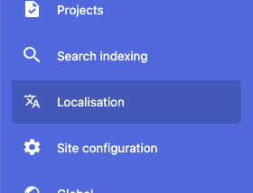
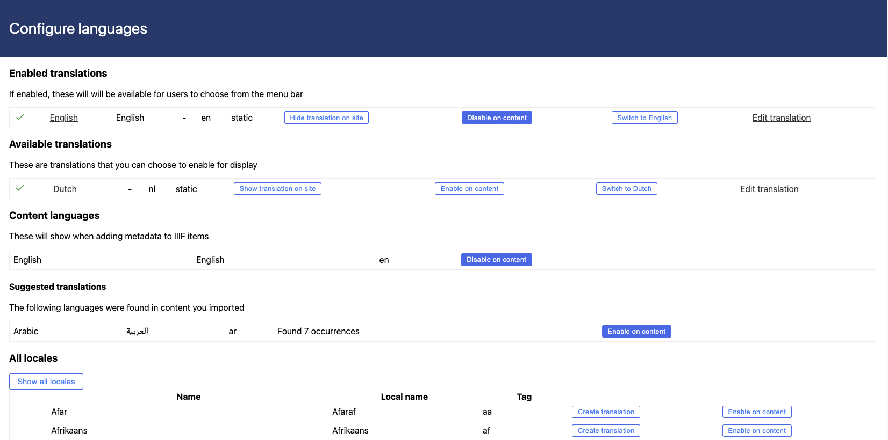
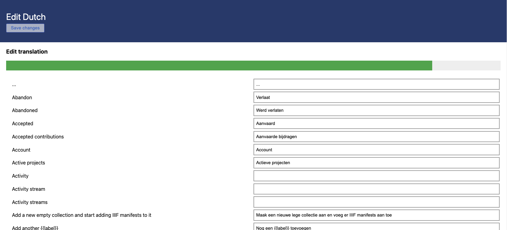

# Internationalisation

Madoc supports various ways to create and present content in multiple languages.

### Site translations

Madoc aims to enable translatable strings on all user-facing parts of Madoc, and we are in the process of adding various Administrative UIs too. There are 2 ways to create translations of these UI elements.

* **Static translations**
* **Dynamic translations**

Madoc uses i18next to provide translations. You can read more here: [https://www.i18next.com/](https://www.i18next.com/) 

#### Static translations

Static translations are translations of Madoc's UI that are available to Madoc as JSON. If you would like to provide translations to Madoc, you can create a JSON using the following template:



Where the values in each row are the translated equivalents. This JSON can either be contributed back to Madoc in the following folder in the repository:

```text
/services/madoc-ts/translations/[LANG-CODE]/madoc.json
```

Or you can add them directly into your madoc installation by voluming into the `madoc-ts` container at the following location:

```text
/home/node/app/translations/[LANG-CODE]/madoc.json
```

Once this JSON exists it will be available from the Admin UI \(shown below\).

#### Dynamic translations

Dynamic translations do not exist as JSON on the filesystem, instead they exist in a database. This allows you to change, correct or create new translations directly within Madoc. These dynamic translations are merged with the static translations ensuring that your dynamic translation has any new keys added in a Madoc update.

### Localisation UI

You can see static translations and dynamic translations from inside Madoc.



From this page you will see some headings:

* **Enabled translations** - a list of the site translations that will be shown as options to the user in a dropdown in the top right hand corner of the site. If there is only one of these, then no dropdown will be shown.
* **Available translations** - a list of the translations that have been detected but are not enabled in the dropdown. If a users browser matches one of these languages it may be automatically selected.
* **Content languages** - a list of languages that will be shown when editing metadata in the Madoc admin, even if there is not a site translation for them.
* **All locales** - A list of all known locales, most without translations. You can use this list to enable new content languages or create new translations from the UI.

These are also some actions:

* **Hide translation on site** - This will hide the specified translation from the dropdown on your site.
* **Show translation on site** - This will show the specific translation in the dropdown on your site.
* **Disable on content** - This will hide the specified language from the metadata editing UI, preventing new content to be added in this language on IIIF resources.
* **Enable on content** - This will show the specified language in the metadata editing UI, allowing new content to be added in this language on IIIF resources.
* **Edit translation** - This will take you to a page where you can edit the translation. 
* **Create translation** - This will take you to a page where you can fill out the required translations and then save them to create a new site translation.
* **Switch to \[language\]** - This will switch your language to the one specified for your current session. This is only for your logged in user and can be used for testing.



### Editing translations

If you create a new translation or edit an existing one it will be saved in the database as a dynamic translation. In the future you will be able to fill out these translations on the site and download the static JSON.



At the top you will see a green bar indicating how much of the translatable strings have been translated. Under that you will see labels and text boxes that you can fill in with the appropriate translations. At the top of the page there is a button to save your changes.

### Content translations

When you import IIIF with more than one language string, the [language closest](https://www.i18next.com/principles/translation-resolution#languages) to the users current language will be chosen and one value will be shown. We are working on ways to display more than one language in some cases for IIIF metadata and other content on the site.

