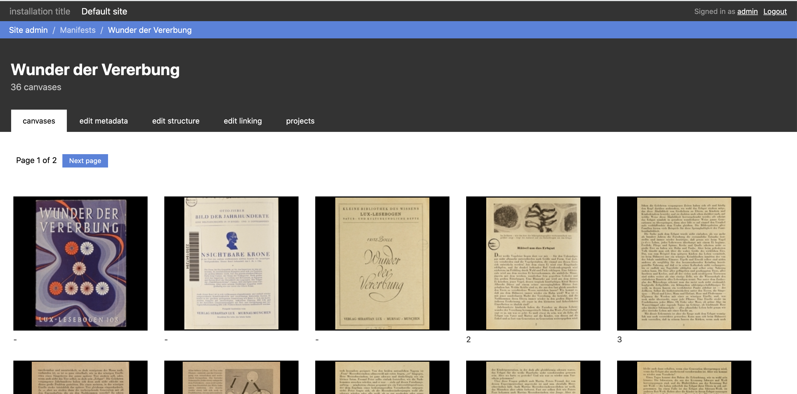
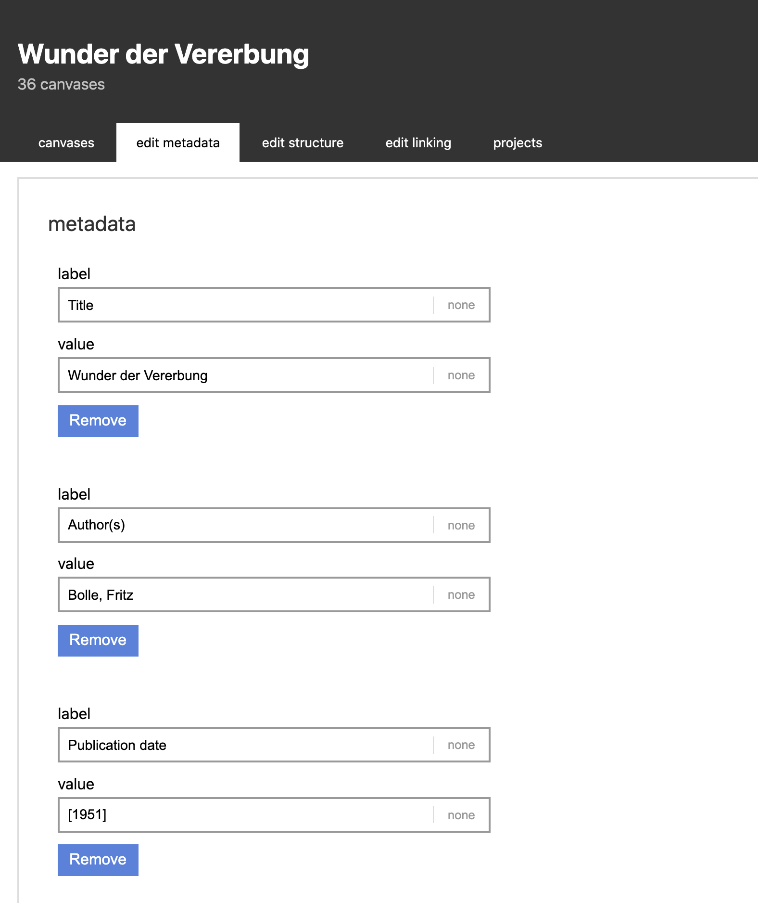
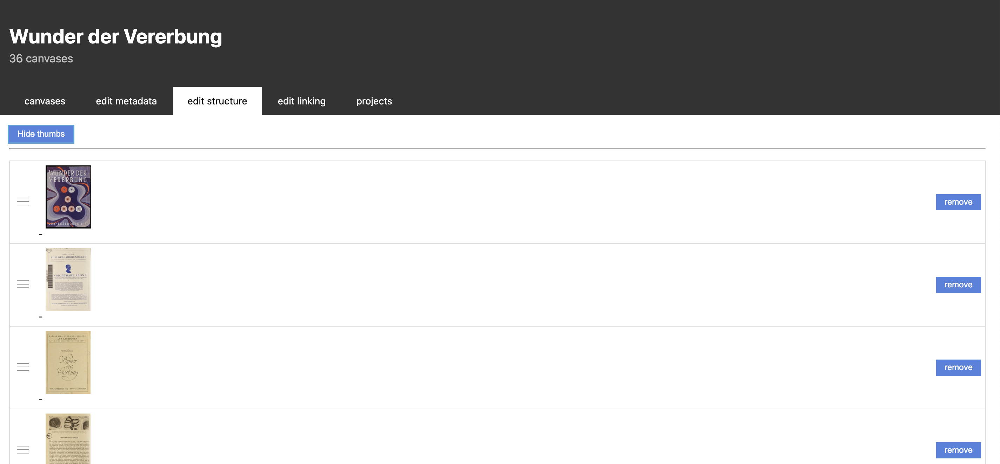

# IIIF Manifests

Starting from the [Madoc admin page](../../administration-pages.md#madoc-admin-page) in the first column on the left you will see "Manage manifests". The rest if this guide will start from this page.

## Importing an existing manifest

If you have no manifests in your Madoc site, the only thing you will see on this page is an "Import manifest" button. If you click this it will take you to a page where you can import an existing manifest from a remote URL.

When you paste in a URL pointing to a IIIF manifest and click import, the browser will fetch the manifest and show you a preview of the manifest before you import it.

Here you can make sure that the thumbnails are generating correctly and that this is the correct manifest. Once you are ready you can click "Import manifest".

As manifests can be very large in size - large books or photograph collections - we split up the import process and import each canvas/image individually. This ensures that if something goes wrong, you only have to reimport the affected images.

After clicking import you will see the progress of your import. If your manifest is small this will not take long. You do not need to stay on this page to wait for your import.

Once your import has completed you can click "view manifest" and go to the manifest page. If there was an error during the import, a red icon will appear on the left. You can retry the import of just a single canvas/image by clicking the "Retry" button the right.

If you would like to import many manifests, you may consider [importing a IIIF collection](collections.md#importing-an-existing-collection).

## Navigating your manifest

Once you have imported a manifest, when you go back to the manifests homepage you should see it in the list from the page we started from \(Manage manifests\). If you click into any of the manifests you will see the manifest homepage. Here you can edit various parts of the manifest.

## Adding labels and metadata

From this page, if you click on "Edit metadata" you will be able to see any metadata that was imported from your manifest. You can edit or add new metadata items from this page. You can also change or add new language values to the metadata.

## Hiding some canvases and reordering

From the manifest page, if you click on the "structure" tab you will be taken to a page listing all of the canvases or images in your manifest. If your manifest does not have descriptive labels you can click on "show thumbs" to see a preview of each image.

From this page you can reorder the images in your manifest by dragging the handles on the left hand side.

You can also remove or hide a canvas using the button on the right - this will remove it from the site and any places where you crowdsource. The canvas is not lost and can be re-added.


When you remove an item or sort your manifest, make sure to click the save button in the top left before navigating away.


At the bottom of the page you will see any canvases that you have previously removed. You can add them back to the manifest using the "Add" button. The image will be placed at the end of the manifest, so make sure to reorder if it is in the wrong place.

## Seeing which projects your manifest is in

Once you create a [project](../projects/) if this manifest is a part of any projects the project will be available from the projects tab on the manifest page. If this manifest is in a collection that is part of a project, that project will also appear here.

## Seeing linking properties

When importing a manifest, some other external content may also be found. These include external metadata or attached OCR content. At the moment you can only see the list of links that were found on the manifest. APIs are available if you would like to read / write or manage these links.

## Checking if a manifest can be OCR corrected

From the [Madoc admin page](../../administration-pages.md#madoc-admin-page) in the 3rd column you can click on the "OCR" menu to see any manifests that have been imported with [OCR data](../ocr/).

