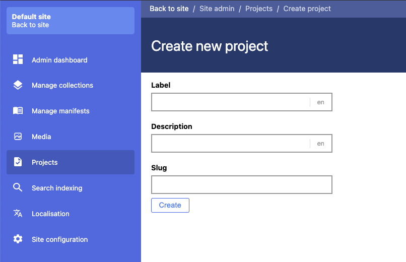
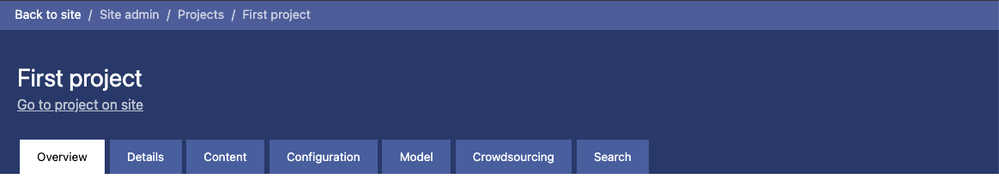

# Adding a new project

You can navigate to your projects from the left hand navigation in the admin.

On the main projects page you will see a list of all of the projects that are running on your site. There will be 5 projects shown per page and you can page through if you have more. To create a new project click on the button in the top left corner.

Here you will be prompted to add a label, description and a slug for your project. The slug will be used in the URL when navigating the frontend site. 

Once you created your project you will be taken to the main project landing page. From here you can edit the metadata of the project, manage its content add a model and visualise the progress of the project. These will be covered in the following chapters.

### Technical details

Under the hood, the metadata for a project \(title and description\) are modelled as a IIIF collection. All of the content in a project is stored in this collection and is accessible via the same APIs as normal collections. The one difference is that it is a flat collection. When you add a collection to a project, all of the manifests inside of that collection will be extracted and also added to the project. This creates a flat structure where all of the manifests and collections can be seen directly under the project.

